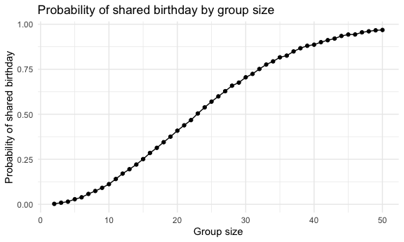
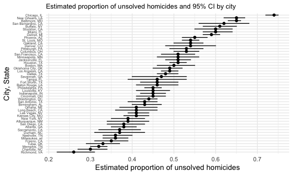

p8105_hw5_yx2857
================

``` r
library(tidyverse)
```

    ## ── Attaching core tidyverse packages ──────────────────────── tidyverse 2.0.0 ──
    ## ✔ dplyr     1.1.4     ✔ readr     2.1.5
    ## ✔ forcats   1.0.0     ✔ stringr   1.5.1
    ## ✔ ggplot2   3.5.1     ✔ tibble    3.2.1
    ## ✔ lubridate 1.9.3     ✔ tidyr     1.3.1
    ## ✔ purrr     1.0.2     
    ## ── Conflicts ────────────────────────────────────────── tidyverse_conflicts() ──
    ## ✖ dplyr::filter() masks stats::filter()
    ## ✖ dplyr::lag()    masks stats::lag()
    ## ℹ Use the conflicted package (<http://conflicted.r-lib.org/>) to force all conflicts to become errors

``` r
library(broom)
library(ggplot2)
set.seed(2857)


theme_set(theme_minimal() + theme(legend.position = "bottom"))

options(
  ggplot2.continuous.colour = "viridis",
  ggplot2.continuous.fill = "viridis"
)

scale_colour_discrete = scale_colour_viridis_d
scale_fill_discrete = scale_fill_viridis_d
```

# Problem 1.

``` r
# Suppose you put 𝑛people in a room, and want to know the probability that at least two people share a birthday. For simplicity, we’ll assume there are no leap years (i.e. there are only 365 days) and that birthdays are uniformly distributed over the year (which is actually not the case).

# Write a function that, for a fixed group size, randomly draws “birthdays” for each person; checks whether there are duplicate birthdays in the group; and returns TRUE or FALSE based on the result.

# Next, run this function 10000 times for each group size between 2 and 50. For each group size, compute the probability that at least two people in the group will share a birthday by averaging across the 10000 simulation runs. Make a plot showing the probability as a function of group size, and comment on your results.
```

# Problem 2.

``` r
# When designing an experiment or analysis, a common question is whether it is likely that a true effect will be detected – put differently, whether a false null hypothesis will be rejected. The probability that a false null hypothesis is rejected is referred to as power, and it depends on several factors, including: the sample size; the effect size; and the error variance. In this problem, you will conduct a simulation to explore power in a one-sample t-test.
 
# First set the following design elements:
# 

# Generate 5000 datasets from the model 𝑥∼𝑁𝑜𝑟𝑚𝑎𝑙[𝜇,𝜎] # Fix 𝑛=30, 𝜎=5 and Set 𝜇=0

# Function generate random samples, substracting mean and p-value
sim_mean_p = function(samp_size = 30, true_mean = 0, true_sd = 5, mu = 0) {
  
  sim_df = 
    tibble(
      x = rnorm(samp_size, true_mean, true_sd)
    )

  s_mean = 
    sim_df |> 
    summarize(
      samp_mean = mean(x),
      p_val = t.test(x, mu = mu)|>broom::tidy()|>pull(p.value)|>round(3)
    )
  
  return(s_mean)
}

# # Set iteration
# n <- 5000
# 
# sim_res_0 <- tibble(
#   iter = 1:n) |> 
#   mutate(samp_res = map(iter, ~sim_mean_p(samp_size = 30, true_mean = 0, true_sd = 5, mu = 0))) |> 
#   unnest(samp_res) 


# Parameters
n <- 5000
mu_values <- 0:6

# Generate a list of tibbles for each value of mu
sim_res_list <- map(mu_values, function(mu) {
  tibble(
    iter = 1:n
  ) |> 
    mutate(samp_res = map(iter, ~sim_mean_p(samp_size = 30, true_mean = mu, true_sd = 5, mu = mu))) |> 
    unnest(samp_res)
})

# Name the list based on mu values
names(sim_res_list) <- paste0("mu_", mu_values)


# Combine all results into a single tibble with an additional column for `mu`
combined_results <- bind_rows(
  map2(sim_res_list, mu_values, ~mutate(.x, mu = .y))
)
```

``` r
# Make a plot showing the proportion of times the null was rejected (the power of the test) on the y axis and the true value of mu on the x axis. Describe the association between effect size and power.
combined_results |> group_by(mu) |>
  summarize(power = mean(p_val < 0.05)) |> 
  ggplot(aes(x = mu, y = power)) + geom_point() + geom_line() + labs(title = "Power of the test", x = "True value of mu", y = "Proportion of times the null was rejected")
```


The association between the effect size and power is positive. As the
true value of mu increases, the power of the test also increases. This
is because the larger the effect size, the more likely the null
hypothesis will be rejected.

``` r
# Make a plot showing the average estimate of 𝜇̂ 
#  on the y axis and the true value of 𝜇 on the x axis. 

#  Make a second plot (or overlay on the first) the average estimate of 𝜇̂ only in samples for which the null was rejected on the y axis and the true value of 𝜇 on the x axis. Is the sample average of 𝜇̂ across tests for which the null is rejected approximately equal to the true value of 𝜇? Why or why not?


combined_results |> group_by(mu) |>
  summarize(est_mu = mean(samp_mean)) |> 
  ggplot(aes(x = mu, y = est_mu)) + geom_point() + geom_line() + labs(title = "Average estimate of mu", x = "True value of mu", y = "Average estimate of mu")
```


``` r
combined_results |> filter(p_val < 0.05) |> group_by(mu) |>
  summarize(est_mu = mean(samp_mean)) |> 
  ggplot(aes(x = mu, y = est_mu)) + geom_point() + geom_line() + labs(title = "Average estimate of mu in samples for which the null was rejected", x = "True value of mu", y = "Average estimate of mu")
```


``` r
# overlay the second plot on the first plot
combined_results |> group_by(mu) |>
  summarize(est_mu = mean(samp_mean)) |> 
  ggplot(aes(x = mu, y = est_mu)) + geom_point() + geom_line() + labs(title = "Average estimate of mu and average estimate of the null-rejected", x = "True value of mu", y = "Average estimate of mu") + 
  geom_line(data = combined_results |> filter(p_val < 0.05) |> group_by(mu) |>
               summarize(est_mu = mean(samp_mean)), aes(x = mu, y = est_mu), color = "red")
```


``` r
# Is the sample average of 𝜇̂ across tests for which the null is rejected approximately equal to the true value of 𝜇? Why or why not?
```

The sample average of mu across tests for which the null is rejected is
not approximately equal to the true value of mu. This is because the
sample average of mu is an estimate of the true value of mu, and it is
subject to sampling variability. The sample average of mu in samples for
which the null is rejected is an estimate of the true value of mu in the
subset of samples for which the null is rejected. This estimate is also
subject to sampling variability, and it may not be equal to the true
value of mu.

``` r
# The Washington Post has gathered data on homicides in 50 large U.S. cities and made the data available through a GitHub repository here. You can read their accompanying article here.

#read data from github
homicide_data <- read_csv("https://raw.githubusercontent.com/washingtonpost/data-homicides/master/homicide-data.csv",
                          show_col_types = FALSE)

# Describe the raw data. 
```

The Homicide data contains 52179 observations and 12 variables. The
variables are as follows: uid, reported_date, victim_last, victim_first,
victim_race, victim_age, victim_sex, city, state, lat, lon, and
disposition. The data contains information on homicides in 50 large U.S.
cities. The variables include the unique identifier of the homicide, the
reported date and location of the homicide, the victim’s name and
demographics, and the disposition.

Upon inspection, uid “Tul-000769” was found recorded a wrong state,
which should be “OK” instead of “AL”. The correct state is “OK” based on
the city “Tulsa”, the lat and lon, and the continuous uid coding. Then
this is recoded as “OK” in the data.

``` r
# Create a city_state variable (e.g. “Baltimore, MD”) and then summarize within cities to obtain the total number of homicides and the number of unsolved homicides (those for which the disposition is “Closed without arrest” or “Open/No arrest”).
homicide_data <- homicide_data |>mutate(state = ifelse(uid == "Tul-000769", "OK", state))

homicide_data_city <- homicide_data |> 
  mutate(city_state = str_c(city, ", ", state)) |> 
  group_by(city_state) |> 
  summarize(total_homicides = n(), unsolved_homicides = sum(disposition %in% c("Closed without arrest", "Open/No arrest")))
# For the city of Baltimore, MD, use the prop.test function to estimate the proportion of homicides that are unsolved; save the output of prop.test as an R object, apply the broom::tidy to this object and pull the estimated proportion and confidence intervals from the resulting tidy dataframe.
baltimore_data <- homicide_data_city |> filter(city_state == "Baltimore, MD")
baltimore_prop_test <- prop.test(baltimore_data|>pull(unsolved_homicides), baltimore_data|>pull(total_homicides))
baltimore_prop_test_tidy <- baltimore_prop_test |> broom::tidy()
```

The estimated proportion of unsolved homicides in Baltimore, MD is 0.65.
The 95% confidence interval for the proportion of unsolved homicides in
Baltimore, MD is \[0.63 , 0.66\].

``` r
# Now run prop.test for each of the cities in your dataset, and extract both the proportion of unsolved homicides and the confidence interval for each. Do this within a “tidy” pipeline, making use of purrr::map, purrr::map2, list columns and unnest as necessary to create a tidy dataframe with estimated proportions and CIs for each city.
homicide_data_city_prop_test <- homicide_data_city |> 
  mutate(prop_test = map2(unsolved_homicides, total_homicides, ~prop.test(.x, .y))) |> 
  mutate(prop_test_tidy = map(prop_test, broom::tidy)) |> 
  unnest(prop_test_tidy) |> 
  select(c("city_state","estimate", "conf.low", "conf.high")) |> 
  mutate(estimate = round(estimate, 2), conf.low = round(conf.low, 2), conf.high = round(conf.high, 2))


#Create a plot that shows the estimates and CIs for each city – check out geom_errorbar for a way to add error bars based on the upper and lower limits. Organize cities according to the proportion of unsolved homicides.

homicide_data_city_prop_test |> 
  ggplot(aes(x = reorder(city_state, estimate), y = estimate, ymin = conf.low, ymax = conf.high)) + 
  geom_point() + 
  geom_errorbar(width = 0.2) + 
  coord_flip() + 
  labs(title = "Estimated proportion of unsolved homicides and 95% CI by city", x = "City, State", y = "Estimated proportion of unsolved homicides") + 
  theme(axis.text.y = element_text(size = 5), plot.title = element_text(size = 10))
```


